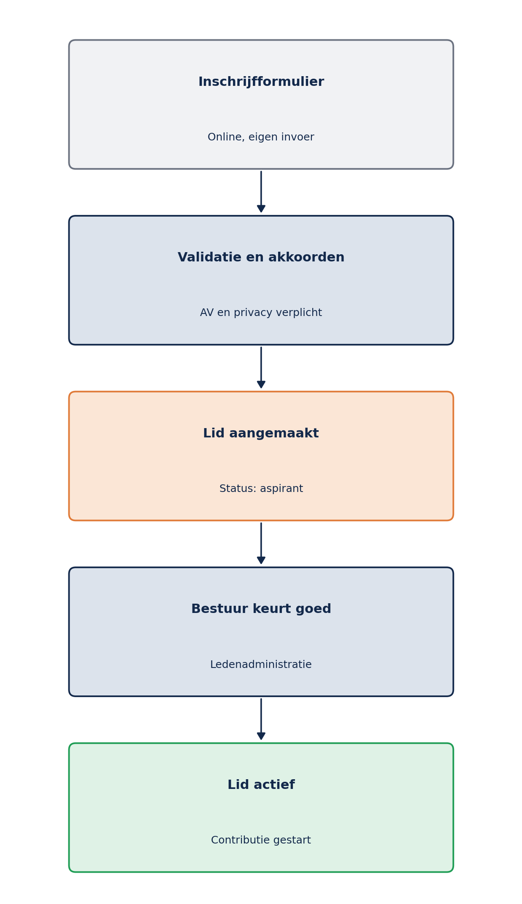
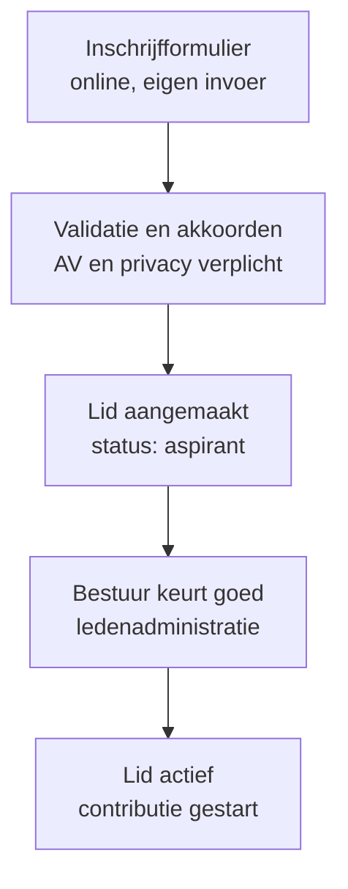
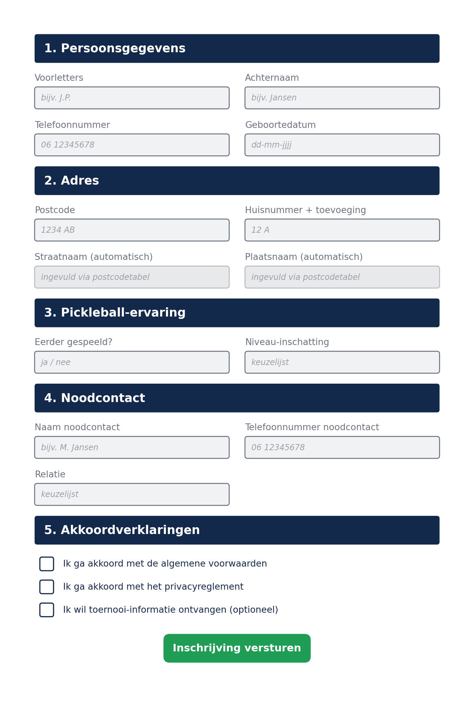
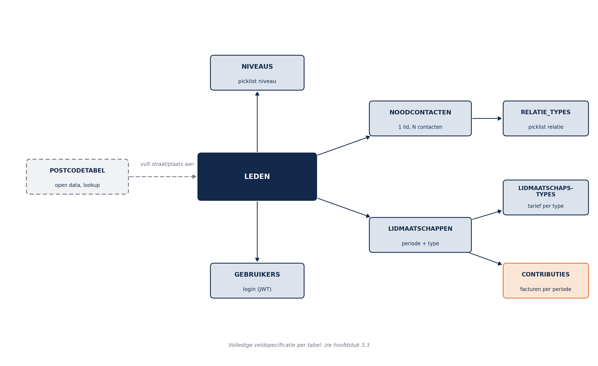
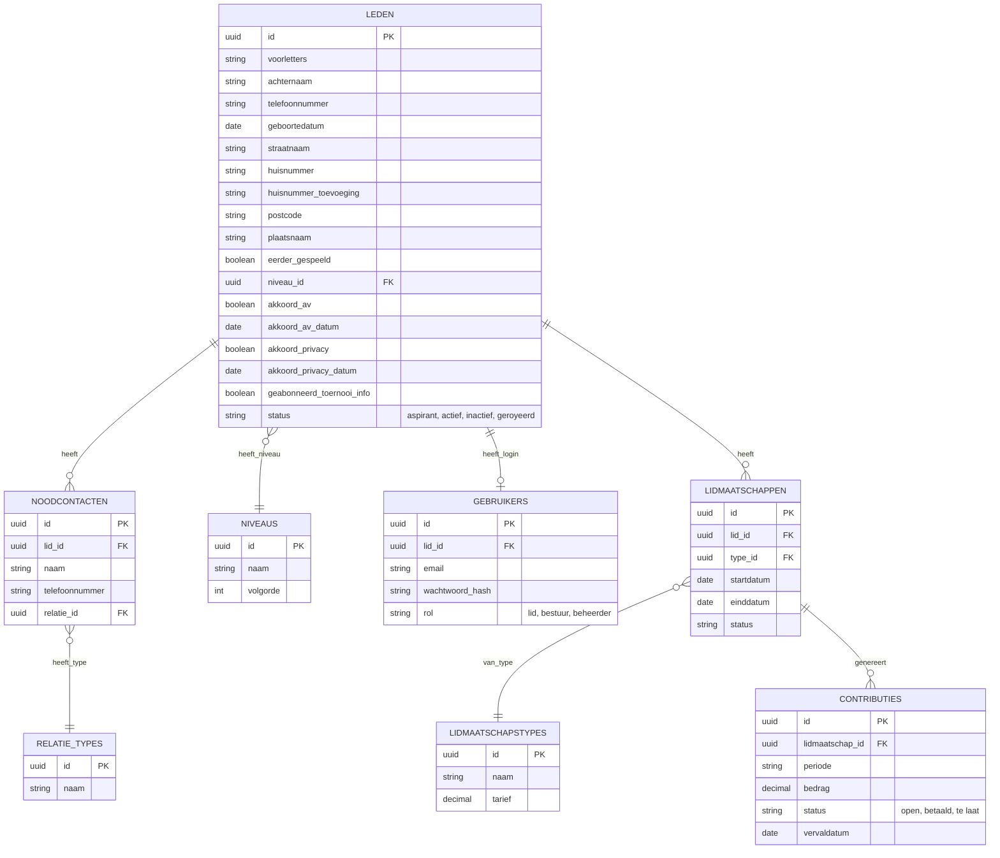
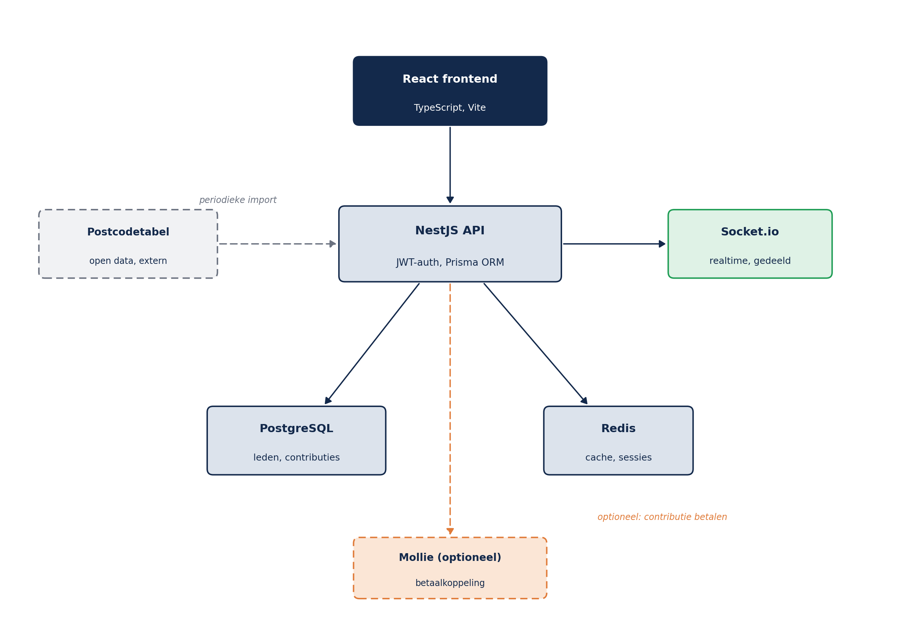
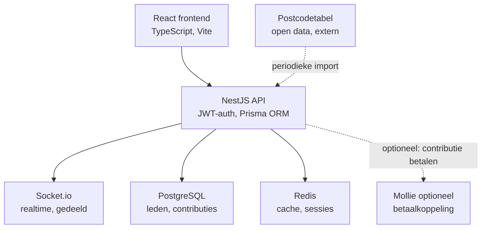

# Ledenadministratie Pickleballstichting Almere
### Functioneel ontwerp, database ontwerp en technisch ontwerp

| | |
|---|---|
| Domein | almere-pickleball.nl |
| Schaal | circa 100 leden, uitlopend naar maximaal 250 leden |
| Techniek | React, NestJS, PostgreSQL, Redis, Socket.io (JWT-authenticatie) |
| Datum | 23 juni 2026 |
| Opgesteld door | ScorePlan |

> Bij dit document hoort Bijlage A: Use cases (zie hoofdstuk 7), met de volledige uitwerking van de meest voorkomende situaties voor zowel bestuur als leden zelf.

---

## 1. Inleiding

Dit document beschrijft het functioneel ontwerp, het database ontwerp en het technisch ontwerp van de ledenadministratie voor Pickleballstichting Almere. De ledenadministratie wordt gebouwd als module binnen het platform dat het bestuur heeft vastgesteld: een React-frontend met een NestJS-API, PostgreSQL als database, Redis voor caching en Socket.io voor realtime-functionaliteit die ook door andere modules wordt gebruikt.

Het systeem wordt gebouwd voor circa 100 leden, met ruimte om te groeien naar maximaal 250 leden. Het domein van het platform is almere-pickleball.nl.

De volledige uitwerking van de meest voorkomende situaties (wie doet wat, wanneer en met welk resultaat) staat in Bijlage A: Use cases.

---

## 2. Functioneel ontwerp

### 2.1 Rollen

| Rol | Rechten |
|---|---|
| Lid | Eigen profiel inzien en wijzigen, zelf aan- en afmelden, niveau aangeven, noodcontact beheren, contributie inzien en betalen, toernooi-opt-in zelf zetten |
| Bestuur / ledenadministratie | Volledig beheer van alle leden, contributiebeheer, rapportages, beheer van de picklists niveaus en relatietypes |
| Systeem (achtergrondtaken) | Contributie genereren per periode, betaalherinneringen, leeftijdsafhankelijke tariefcontrole, periodieke vernieuwing van de postcodetabel |

### 2.2 Use cases (overzicht)

Onderstaande tabel toont de belangrijkste categorieën van use cases. De volledige uitwerking, inclusief de meest voorkomende situaties voor zowel bestuur als leden zelf, staat in Bijlage A: Use cases.

| Categorie | Belangrijkste use cases | Actor |
|---|---|---|
| Aanmelden en lidmaatschap | Online aanmelden, bestuur keurt goed, lid meldt zichzelf af | Lid, bestuur |
| Gegevens beheren | Adres, telefoonnummer en overige gegevens wijzigen | Lid, bestuur |
| Niveau en voorkeuren | Niveau-inschatting aanpassen, toernooi-informatie aan- of uitzetten | Lid |
| Noodcontact | Noodcontact toevoegen of wijzigen | Lid, bestuur |
| Contributie | Contributie genereren, online betalen, betaalstatus bijwerken | Lid, bestuur, systeem |
| Beheer en rapportage | Picklists beheren, ledenlijst en rapportages, lid royeren | Bestuur |

### 2.3 Inschrijfproces

Het kernproces, van inschrijving tot actief lidmaatschap, verloopt in vijf stappen:



*Figuur 1: inschrijfproces van formulier tot actief lidmaatschap*

<details>
<summary>Mermaid-broncode (klik om te bewerken)</summary>



</details>

Zonder akkoord op de algemene voorwaarden en het privacyreglement stroomt een aanmelding niet door naar de status "aspirant". Dat voorkomt discussie achteraf over wie wel of niet akkoord is gegaan.

### 2.4 Front-end: het inschrijfformulier

Het inschrijfformulier is het eerste contactpunt voor een nieuw lid en bevat alle gevraagde rubrieken, gegroepeerd in vijf secties.



*Figuur 2: wireframe van het online inschrijfformulier*

#### Veldspecificatie inschrijfformulier

| Veld | Type | Verplicht | Validatie, bron of opmerking |
|---|---|---|---|
| Voorletters | Tekst | Ja | Maximaal 10 tekens |
| Achternaam | Tekst | Ja | Maximaal 100 tekens |
| Telefoonnummer | Tekst | Ja | Nederlands formaat (mobiel of vast) |
| Geboortedatum | Datum | Ja | Niet in de toekomst; bepaalt het lidmaatschapstarief (junior/senior) |
| Postcode | Tekst | Ja | Nederlands formaat, bijvoorbeeld 1234 AB |
| Huisnummer + toevoeging | Tekst | Ja | Huisnummer numeriek, toevoeging vrij tekstveld |
| Straatnaam | Tekst | Automatisch | Ingevuld via de postcodetabel op basis van postcode en huisnummer |
| Plaatsnaam | Tekst | Automatisch | Ingevuld via de postcodetabel op basis van postcode en huisnummer |
| Eerder pickleball gespeeld? | Ja/nee | Ja | Toggle |
| Niveau-inschatting | Keuzelijst | Ja | Waarden uit tabel niveaus, beheerbaar door bestuur |
| Naam noodcontact | Tekst | Ja | - |
| Telefoonnummer noodcontact | Tekst | Ja | Nederlands formaat |
| Relatie noodcontact | Keuzelijst | Ja | Waarden uit tabel relatie_types, beheerbaar door bestuur |
| Akkoord algemene voorwaarden | Checkbox | Ja | Verzenden geblokkeerd zonder akkoord; datum en versie worden vastgelegd |
| Akkoord privacyreglement | Checkbox | Ja | Verzenden geblokkeerd zonder akkoord; datum en versie worden vastgelegd |
| Geabonneerd op toernooi-informatie | Checkbox | Nee | Optioneel; lid kan dit later zelf wijzigen |

Gedrag van het formulier:

- Bij het invullen van postcode en huisnummer worden straatnaam en plaatsnaam automatisch aangevuld via de postcodetabel; het lid kan dit niet handmatig overschrijven.
- Verplichte velden worden gemarkeerd; verzenden is geblokkeerd zolang een verplicht veld leeg is of een akkoordvakje niet is aangevinkt.
- Na verzenden krijgt de aanmelding de status "aspirant" totdat het bestuur deze goedkeurt.

---

## 3. Database ontwerp

### 3.1 Tabellen overzicht

| Tabel | Functie |
|---|---|
| leden | Kernrecord met alle gevraagde velden |
| noodcontacten | 1 op N: een lid kan meerdere noodcontacten hebben |
| niveaus | Picklist niveau-inschatting, beheerbaar door bestuur |
| relatie_types | Picklist relatie noodcontact, beheerbaar door bestuur |
| gebruikers | Login/auth, gekoppeld aan een lid |
| lidmaatschappen | Periodes van lidmaatschap (type, start, einde) |
| lidmaatschapstypes | Senior, junior, student, gezin, met tarief |
| contributies | Facturen per periode, met betaalstatus |
| postcodetabel | Open data referentietabel om straat en plaats automatisch aan te vullen |
| audit_log (aanbevolen) | Legt wijzigingen aan persoonsgegevens vast (wie, wat, wanneer); niet in kernscope |

### 3.2 Entiteit-relatiediagram



*Figuur 3: entiteit-relatiediagram op hoofdlijnen*

<details>
<summary>Mermaid-broncode met volledige veldspecificatie (klik om te bewerken)</summary>



</details>

De postcodetabel staat los van de kernstructuur: het is een extern aangeleverde, periodiek vernieuwde referentietabel die alleen wordt gebruikt om straatnaam en plaatsnaam aan te vullen, niet om naar te verwijzen met een foreign key.

### 3.3 Veldspecificatie per tabel

#### leden

| Veld | Type | Opmerking |
|---|---|---|
| id | uuid (PK) | - |
| voorletters | string | - |
| achternaam | string | - |
| telefoonnummer | string | - |
| geboortedatum | date | - |
| straatnaam | string | Automatisch via postcodetabel |
| huisnummer | string | - |
| huisnummer_toevoeging | string | Optioneel |
| postcode | string | - |
| plaatsnaam | string | Automatisch via postcodetabel |
| eerder_gespeeld | boolean | - |
| niveau_id | uuid (FK) | Verwijst naar niveaus |
| akkoord_av | boolean | - |
| akkoord_av_datum | date | Voor bewijslast |
| akkoord_privacy | boolean | - |
| akkoord_privacy_datum | date | Voor bewijslast |
| geabonneerd_toernooi_info | boolean | - |
| status | string | aspirant, actief, inactief, geroyeerd |

#### noodcontacten

| Veld | Type | Opmerking |
|---|---|---|
| id | uuid (PK) | - |
| lid_id | uuid (FK) | Verwijst naar leden |
| naam | string | - |
| telefoonnummer | string | - |
| relatie_id | uuid (FK) | Verwijst naar relatie_types |

#### niveaus

| Veld | Type | Opmerking |
|---|---|---|
| id | uuid (PK) | - |
| naam | string | Bijvoorbeeld: beginner, gevorderd |
| volgorde | int | Voor sortering in de keuzelijst |

#### relatie_types

| Veld | Type | Opmerking |
|---|---|---|
| id | uuid (PK) | - |
| naam | string | Bijvoorbeeld: partner, ouder, kind |

#### gebruikers

| Veld | Type | Opmerking |
|---|---|---|
| id | uuid (PK) | - |
| lid_id | uuid (FK) | Verwijst naar leden |
| email | string | - |
| wachtwoord_hash | string | Nooit in platte tekst opslaan |
| rol | string | lid, bestuur of beheerder |

#### lidmaatschappen

| Veld | Type | Opmerking |
|---|---|---|
| id | uuid (PK) | - |
| lid_id | uuid (FK) | Verwijst naar leden |
| type_id | uuid (FK) | Verwijst naar lidmaatschapstypes |
| startdatum | date | - |
| einddatum | date | Nullable |
| status | string | - |

#### lidmaatschapstypes

| Veld | Type | Opmerking |
|---|---|---|
| id | uuid (PK) | - |
| naam | string | Senior, junior, student, gezin |
| tarief | decimal | - |

#### contributies

| Veld | Type | Opmerking |
|---|---|---|
| id | uuid (PK) | - |
| lidmaatschap_id | uuid (FK) | Verwijst naar lidmaatschappen |
| periode | string | - |
| bedrag | decimal | - |
| status | string | open, betaald, te laat |
| vervaldatum | date | - |

#### postcodetabel

| Veld | Type | Opmerking |
|---|---|---|
| id | uuid (PK) | - |
| postcode | string | - |
| huisnummer | int | - |
| huisnummer_toevoeging | string | Nullable |
| straatnaam | string | - |
| plaatsnaam | string | - |
| gemeente | string | Nullable |
| laatst_bijgewerkt | date | Voor de periodieke import/refresh |

### 3.4 Ontwerpkeuzes

- Picklists als losse tabellen, geen hardcoded enums. Niveau en relatie-noodcontact staan in niveaus en relatie_types, niet vastgebakken in de frontend-code, zodat het bestuur deze zelf kan beheren zonder nieuwe deploy.
- Huisnummer en toevoeging gesplitst, niet één vrij tekstveld, nodig voor de koppeling met de postcodetabel en voor correcte sortering en filtering.
- Akkoord-velden met datum, niet alleen een boolean, zodat bij een AVG-vraag of geschil aangetoond kan worden wanneer iemand akkoord ging.
- Postcodetabel als losse, periodiek vernieuwde referentietabel op basis van vrij toegankelijke open data, in plaats van een betaalde postcode-API per aanvraag.
- Een audit_log-tabel is aan te raden maar niet in de kernscope opgenomen: deze legt wijzigingen aan persoonsgegevens vast en is de basis van een AVG-verdedigbare ledenadministratie.

Voorgestelde startwaarden niveaus: beginner, beginnende gevorderde, gevorderd, vergevorderd/competitie.

Voorgestelde startwaarden relatie_types: partner, ouder/verzorger, kind, familie, vriend(in), collega, anders.

---

## 4. Technisch ontwerp

### 4.1 Architectuur

De ledenadministratie wordt een module binnen het platform dat het bestuur heeft vastgesteld, geen los systeem.



*Figuur 4: technische architectuur van de ledenadministratie-module*

<details>
<summary>Mermaid-broncode (klik om te bewerken)</summary>



</details>

Socket.io is voor de ledenadministratie zelf niet nodig (registratie en contributiebeheer zijn geen realtime-processen), maar de module gebruikt dezelfde infrastructuur als de rest van het platform. De postcodetabel wordt periodiek geïmporteerd vanuit een open databron. Mollie is als optionele betaalkoppeling opgenomen voor het online betalen van contributie.

### 4.2 Module-indeling NestJS

| Module | Verantwoordelijkheid |
|---|---|
| leden | Controller, service en validatie voor ledenregistratie en -beheer |
| noodcontacten | Beheer van noodcontactgegevens, gekoppeld aan leden |
| niveaus | Beheer van de niveau-picklist (alleen bestuur/beheerder) |
| relatie-types | Beheer van de relatie-picklist (alleen bestuur/beheerder) |
| lidmaatschappen | Start, einde en type van het lidmaatschap |
| contributies | Genereren van facturen, betaalstatus, eventueel Mollie-webhook |
| postcode | Lookup-endpoint op basis van de lokale postcodetabel |
| auth | JWT-strategie en rollen-guard (lid, bestuur, beheerder) |

```
src/
  leden/              controller, service, dto's, validatie
  noodcontacten/      gekoppeld aan leden
  niveaus/            beheer picklist (alleen rol bestuur/beheerder)
  relatie-types/      beheer picklist (alleen rol bestuur/beheerder)
  lidmaatschappen/    start, einde, type
  contributies/       genereren, betaalstatus, evt. Mollie-webhook
  postcode/           lookup op basis van lokale postcodetabel
  auth/               JWT-strategie, rollen-guard
```

### 4.3 Postcodetabel-koppeling

Voor het adres wordt gebruikgemaakt van een vrij toegankelijke postcodetabel op basis van postcode en huisnummer, in plaats van een betaalde postcode-API per aanvraag. De tabel wordt periodiek (bijvoorbeeld maandelijks of per kwartaal) opnieuw geïmporteerd, omdat straatnamen en huisnummers af en toe wijzigen door nieuwbouw of herindeling. Tijdens het invullen van het inschrijfformulier raadpleegt de frontend een lookup-endpoint dat op basis van postcode en huisnummer de straatnaam en plaatsnaam teruggeeft.

### 4.4 Belangrijkste endpoints (selectie)

| Methode | Route | Rol / toegang |
|---|---|---|
| POST | /leden | Publiek (online inschrijfformulier) |
| GET | /leden?pagina=&zoek= | Bestuur |
| GET | /leden/mij | Lid (eigen profiel) |
| PATCH | /leden/mij | Lid (eigen gegevens wijzigen, incl. adres) |
| POST | /leden/mij/afmelden | Lid (zelf opzeggen) |
| PATCH | /leden/:id | Bestuur |
| PATCH | /leden/:id/status | Bestuur (activeren of royeren) |
| POST | /leden/:id/noodcontact | Bestuur, of lid voor eigen record |
| GET | /postcode-lookup?postcode=&huisnummer= | Publiek (tijdens invullen formulier) |
| PATCH | /niveaus, /relatie-types | Bestuur/beheerder (picklist-beheer) |
| POST | /contributies/genereren | Systeem (cronjob per periode) |
| GET | /contributies/mij | Lid (eigen facturen en betaalstatus) |
| POST | /contributies/:id/betalen | Lid (start online betaling) |
| PATCH | /contributies/:id | Bestuur (betaalstatus handmatig bijwerken) |

### 4.5 AVG en privacy

- Akkoord op de algemene voorwaarden en het privacyreglement is verplicht voor activering, met datum en versie vastgelegd.
- Noodcontactgegevens zijn gevoelig: inzage is beperkt tot bestuur en het lid zelf.
- Betaalgegevens worden niet zelf opgeslagen; dat is de verantwoordelijkheid van de betaalprovider (bijvoorbeeld Mollie).
- Bewaartermijn: na beëindiging van het lidmaatschap worden persoonsgegevens na een redelijke termijn geanonimiseerd; facturen blijven bewaard voor de fiscale bewaarplicht.
- Recht op inzage en correctie verloopt via de self-service-endpoints; recht op vergetelheid via een apart anonimiseer-endpoint.

### 4.6 Schaalbaarheid

Bij 100 tot 250 leden is dit qua volume triviaal voor PostgreSQL; sharding of speciale optimalisatie is niet nodig. Vanaf het begin wel inregelen: een index op achternaam en postcode voor zoeken en sorteren, en paginering op alle lijst-endpoints zodat de frontend niet in één keer alle leden ophaalt.

---

## 5. Aandachtspunten en automatisering

- Geef het bestuur vanaf dag één een eigen beheerscherm voor niveaus en relatietypes, anders verschuift het risico van hardcoded gegevens naar dit deel van de applicatie.
- Voor de contributie-incasso ligt een Mollie-koppeling voor de hand; deze wordt al gebruikt voor het betaalformulier van Jouwtrouwdag.
- Automatiseringskansen op korte termijn: automatische tariefbepaling op basis van geboortedatum (junior versus senior), en een automatische welkomstmail zodra het bestuur een lid goedkeurt.
- De postcodetabel vraagt een terugkerende onderhoudstaak (periodieke import); dit kan als eenvoudige geplande taak worden ingericht zodra de bron definitief is.

---

## 6. Vervolgstappen

- Definitieve huisstijlkleuren en logo van ScorePlan en Pickleballstichting Almere aanleveren voor consistente toepassing in de uiteindelijke applicatie.
- Bron en aanlevering van de postcodetabel bevestigen (bestandsformaat, frequentie van vernieuwen).
- Startwaarden voor niveaus en relatie_types laten vaststellen door het bestuur.
- Bijlage A: Use cases laten doornemen door bestuur en ontwikkelaar, als basis voor de bouw.

---

## 7. Bijlage A: Use cases

Deze bijlage werkt de meest voorkomende situaties uit als use cases, zowel voor het bestuur/de ledenadministratie als voor leden zelf via self-service. Elke use case beschrijft de actor, de aanleiding, eventuele voorwaarden, de stappen, het resultaat en eventuele uitzonderingen.

### A.1 Bestuur en ledenadministratie

#### UC-B01: Nieuw lid handmatig registreren

- **Actor**: Bestuur / ledenadministratie
- **Aanleiding**: Een nieuw lid meldt zich telefonisch, op locatie of per e-mail aan in plaats van via het online formulier.
- **Voorwaarden**: Het bestuurslid heeft toegang tot het beheerscherm leden.
- **Stappen**:
  1. Bestuurslid opent "Nieuw lid toevoegen" in het beheerscherm.
  2. Bestuurslid vult de gegevens van het lid in, inclusief adres, niveau en noodcontact.
  3. Bestuurslid bevestigt namens het lid dat de algemene voorwaarden en het privacyreglement zijn besproken en geaccepteerd.
  4. Systeem slaat het lid op met status "actief".
- **Resultaat**: Het lid staat direct als actief lid in het systeem.
- **Uitzondering**: Als het bestuurslid geen geldig akkoord kan bevestigen, blijft het lid op status "aspirant" totdat dit alsnog is geregeld.

#### UC-B02: Lid goedkeuren na online inschrijving

- **Actor**: Bestuur / ledenadministratie
- **Aanleiding**: Een lid heeft zichzelf online aangemeld (UC-L01) en staat met status "aspirant" klaar voor goedkeuring.
- **Voorwaarden**: De aanmelding bevat een geldig akkoord op de algemene voorwaarden en het privacyreglement.
- **Stappen**:
  1. Bestuurslid ontvangt een melding van een nieuwe aanmelding.
  2. Bestuurslid controleert de gegevens.
  3. Bestuurslid keurt de aanmelding goed.
  4. Systeem zet de status op "actief" en start de contributieperiode.
  5. Systeem verstuurt een welkomstmail aan het lid.
- **Resultaat**: Het lid is actief en de eerste contributie staat open.
- **Uitzondering**: Bestuurslid kan de aanmelding afwijzen, bijvoorbeeld bij twijfel over de gegevens; het lid krijgt een melding met het verzoek om contact op te nemen.

#### UC-B03: Lidgegevens wijzigen namens een lid

- **Actor**: Bestuur / ledenadministratie
- **Aanleiding**: Een lid vraagt telefonisch of per e-mail om een wijziging, of kan zelf niet inloggen.
- **Stappen**:
  1. Bestuurslid zoekt het lid op in het beheerscherm.
  2. Bestuurslid past het gevraagde veld aan, bijvoorbeeld telefoonnummer of adres.
  3. Systeem slaat de wijziging op en legt vast wie deze heeft uitgevoerd.
- **Resultaat**: De gegevens van het lid zijn bijgewerkt.

#### UC-B04: Lid royeren wegens wanbetaling of opzegging

- **Actor**: Bestuur / ledenadministratie
- **Aanleiding**: Een lid heeft meerdere periodes niet betaald, of een opzegging is niet via self-service verwerkt.
- **Stappen**:
  1. Bestuurslid opent het lidprofiel.
  2. Bestuurslid zet de status op "geroyeerd" met een reden.
  3. Systeem beëindigt het actieve lidmaatschap en sluit openstaande contributies af volgens het vastgestelde beleid.
- **Resultaat**: Het lid is niet langer actief; toegang tot het ledenportaal wordt beperkt tot het eigen historisch overzicht.
- **Uitzondering**: Bij een betalingsachterstand kan het bestuur eerst een herinnering versturen (UC-B07) voordat tot royement wordt overgegaan.

#### UC-B05: Niveau- of relatiepicklist beheren

- **Actor**: Bestuur / ledenadministratie (rol beheerder)
- **Aanleiding**: Een nieuw niveau of een nieuwe relatiesoort moet worden toegevoegd, of de volgorde moet wijzigen.
- **Stappen**:
  1. Bestuurslid opent het beheerscherm voor niveaus of relatietypes.
  2. Bestuurslid voegt een waarde toe, wijzigt de naam, of past de volgorde aan.
  3. Systeem slaat de wijziging direct op, zonder dat de applicatie opnieuw uitgerold moet worden.
- **Resultaat**: De picklist is bijgewerkt en direct zichtbaar in het inschrijfformulier en ledenprofiel.

#### UC-B06: Contributie genereren voor een nieuwe periode

- **Actor**: Systeem (met bestuur als toezichthouder)
- **Aanleiding**: Een nieuwe contributieperiode, bijvoorbeeld een nieuw seizoen, gaat in.
- **Voorwaarden**: Alle actieve lidmaatschappen hebben een geldig lidmaatschapstype met tarief.
- **Stappen**:
  1. Systeem start de geplande taak voor het genereren van contributies.
  2. Systeem maakt voor elk actief lidmaatschap een contributieregel aan op basis van het tarief.
  3. Systeem stelt de status van elke contributie in op "open" met een vervaldatum.
  4. Leden zien de nieuwe contributie in hun eigen overzicht en kunnen deze direct betalen.
- **Resultaat**: Alle actieve leden hebben een actuele, openstaande contributie voor de nieuwe periode.
- **Uitzondering**: Bestuur kan een lid handmatig uitsluiten van een automatische run, bijvoorbeeld bij een lopende coulanceregeling.

#### UC-B07: Betaalstatus handmatig bijwerken

- **Actor**: Bestuur / ledenadministratie
- **Aanleiding**: Een lid heeft buiten het systeem om betaald, bijvoorbeeld contant of via een overschrijving zonder online koppeling.
- **Stappen**:
  1. Bestuurslid zoekt de betreffende contributie op.
  2. Bestuurslid zet de status op "betaald" en legt de betaaldatum vast.
- **Resultaat**: De contributie staat niet langer als open of te laat geregistreerd.

#### UC-B08: Ledenlijst en rapportages opvragen

- **Actor**: Bestuur / ledenadministratie
- **Aanleiding**: Het bestuur heeft een overzicht nodig, bijvoorbeeld voor een bestuursvergadering of bondsregistratie.
- **Stappen**:
  1. Bestuurslid opent het rapportage-onderdeel.
  2. Bestuurslid kiest het gewenste overzicht: ledenlijst, niveauverdeling, leeftijdsopbouw of openstaande contributie.
  3. Systeem genereert het overzicht, eventueel als AVG-proof export zonder onnodige persoonsgegevens.
- **Resultaat**: Het bestuur heeft een actueel overzicht beschikbaar.

### A.2 Leden (self-service)

#### UC-L01: Lid meldt zichzelf aan

- **Actor**: Bezoeker (nieuwe aanmelding, nog geen account)
- **Aanleiding**: Iemand wil lid worden van de pickleballclub.
- **Stappen**:
  1. Bezoeker vult het online inschrijfformulier in (zie hoofdstuk 2.4).
  2. Bij het invullen van postcode en huisnummer worden straatnaam en plaatsnaam automatisch aangevuld.
  3. Bezoeker geeft niveau-inschatting en noodcontact op.
  4. Bezoeker gaat akkoord met de algemene voorwaarden en het privacyreglement.
  5. Bezoeker verstuurt het formulier.
- **Resultaat**: Er is een nieuw lidrecord met status "aspirant", in afwachting van goedkeuring door het bestuur (UC-B02).
- **Uitzondering**: Verzenden is niet mogelijk zolang verplichte velden ontbreken of de akkoordvakjes niet zijn aangevinkt.

#### UC-L02: Lid meldt zichzelf af

- **Actor**: Lid (ingelogd)
- **Aanleiding**: Een lid wil het lidmaatschap beëindigen.
- **Voorwaarden**: Lid is ingelogd in het ledenportaal.
- **Stappen**:
  1. Lid gaat naar het eigen profiel en kiest "Lidmaatschap opzeggen".
  2. Systeem toont eventuele openstaande contributie en de geldende opzegtermijn.
  3. Lid bevestigt de opzegging.
  4. Systeem zet de status op "inactief" met een einddatum.
- **Resultaat**: Het lidmaatschap is beëindigd; toegang tot self-service blijft beperkt beschikbaar voor het inzien van de eigen betaalhistorie.
- **Uitzondering**: Bij een openstaande contributie kan het bestuur de afmelding pas definitief afronden na betaling, afhankelijk van het verenigingsbeleid.

#### UC-L03: Lid wijzigt adresgegevens

- **Actor**: Lid (ingelogd)
- **Aanleiding**: Een lid is verhuisd.
- **Stappen**:
  1. Lid opent het eigen profiel.
  2. Lid vult de nieuwe postcode en het huisnummer in.
  3. Systeem haalt straatnaam en plaatsnaam automatisch op via de postcodetabel.
  4. Lid bevestigt en slaat de wijziging op.
- **Resultaat**: Het adres van het lid is bijgewerkt.

#### UC-L04: Lid wijzigt telefoonnummer of vraagt geboortedatum-correctie aan

- **Actor**: Lid (ingelogd)
- **Aanleiding**: Een telefoonnummer is gewijzigd, of een geboortedatum is bij aanmelding verkeerd ingevoerd.
- **Stappen**:
  1. Lid opent het eigen profiel.
  2. Lid past het telefoonnummer aan, of vraagt een correctie van de geboortedatum aan.
  3. Systeem slaat een wijziging van het telefoonnummer direct op.
- **Resultaat**: Het telefoonnummer is direct bijgewerkt.
- **Uitzondering**: Een wijziging van de geboortedatum kan, omdat deze het lidmaatschapstarief beïnvloedt, een goedkeuringsstap door het bestuur vereisen in plaats van directe self-service-opslag.

#### UC-L05: Lid past niveau-inschatting aan

- **Actor**: Lid (ingelogd)
- **Aanleiding**: Het spelniveau van het lid is veranderd.
- **Stappen**:
  1. Lid opent het eigen profiel.
  2. Lid kiest een andere waarde uit de niveau-keuzelijst.
  3. Systeem slaat de wijziging direct op.
- **Resultaat**: Het niveau van het lid is bijgewerkt.

#### UC-L06: Lid wijzigt noodcontactgegevens

- **Actor**: Lid (ingelogd)
- **Aanleiding**: De naam, het telefoonnummer of de relatie van het noodcontact is gewijzigd.
- **Stappen**:
  1. Lid opent het eigen profiel.
  2. Lid past naam, telefoonnummer of relatie van het noodcontact aan.
  3. Systeem slaat de wijziging direct op.
- **Resultaat**: De noodcontactgegevens zijn actueel.

#### UC-L07: Lid (de)abonneert zich op toernooi-informatie

- **Actor**: Lid (ingelogd)
- **Aanleiding**: Een lid wil wel of juist niet meer op de hoogte gehouden worden van toernooien.
- **Stappen**:
  1. Lid opent het eigen profiel.
  2. Lid zet de toggle voor toernooi-informatie aan of uit.
- **Resultaat**: De voorkeur van het lid is direct bijgewerkt en wordt gebruikt bij de volgende toernooicommunicatie.

#### UC-L08: Lid bekijkt openstaande contributie en betaalt online

- **Actor**: Lid (ingelogd)
- **Aanleiding**: Er staat een contributie open voor de huidige periode.
- **Voorwaarden**: Er is een online betaalkoppeling beschikbaar, bijvoorbeeld Mollie.
- **Stappen**:
  1. Lid opent het onderdeel "Contributie" in het eigen profiel.
  2. Lid ziet het openstaande bedrag en de vervaldatum.
  3. Lid start de betaling.
  4. Lid wordt doorgestuurd naar de betaalprovider en rondt de betaling af.
  5. Systeem ontvangt een bevestiging van de betaalprovider en zet de status op "betaald".
- **Resultaat**: De contributie staat als betaald geregistreerd, zonder dat het bestuur dit handmatig moet bijwerken.
- **Uitzondering**: Bij een mislukte betaling blijft de status "open" en kan het lid het opnieuw proberen.

#### UC-L09: Lid bekijkt betaalhistorie

- **Actor**: Lid (ingelogd)
- **Aanleiding**: Een lid wil een eerdere betaling of factuur terugzien.
- **Stappen**:
  1. Lid opent het onderdeel "Contributie" in het eigen profiel.
  2. Lid bekijkt het overzicht van eerdere periodes en betaalstatussen.
- **Resultaat**: Het lid heeft inzicht in de eigen betaalhistorie.

#### UC-L10: Lid herstelt een vergeten wachtwoord

- **Actor**: Lid
- **Aanleiding**: Een lid is het wachtwoord vergeten.
- **Voorwaarden**: Het lid heeft een geldig e-mailadres geregistreerd in de gebruikers-tabel.
- **Stappen**:
  1. Lid kiest "Wachtwoord vergeten" op het inlogscherm.
  2. Lid vult het eigen e-mailadres in.
  3. Systeem verstuurt een tijdelijke resetlink per e-mail.
  4. Lid stelt via de link een nieuw wachtwoord in.
- **Resultaat**: Het lid kan weer inloggen met het nieuwe wachtwoord.
- **Uitzondering**: Als het e-mailadres niet bekend is, toont het systeem een neutrale melding zonder te bevestigen of het adres wel of niet geregistreerd is.

---

*Opgesteld als functioneel, database en technisch ontwerp voor ScorePlan / Pickleballstichting Almere. De diagrammen staan als afbeelding in de map assets/ en zijn als Mermaid-broncode opgenomen in de uitklapbare blokken, zodat ze in GitHub te bewerken zijn. Een opgemaakte Word-versie van dit document en de losse use cases staan als LEDENADMINISTRATIE_ONTWERP.docx en BIJLAGE_A_USE_CASES.docx in dezelfde map.*
